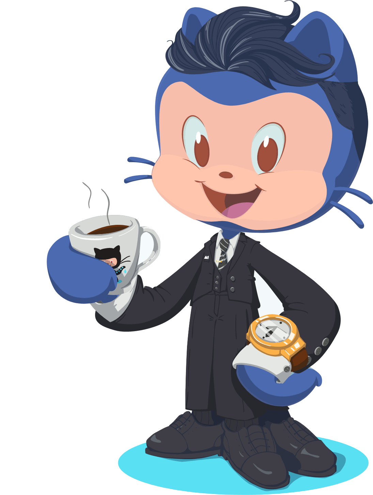
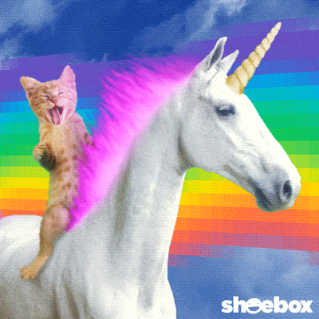

# Hello friends.  I'm **Bryon Smith**. Thanks for stopping by. &#x1F604;

<!-- <div id="header" align="center">

</div> -->

```javascript
const bryon = {
  pronouns: 'He' | 'Him',
  askMeAbout: ['web dev', 'tech', 'automotive'],
  technologies: {
    frontEnd: {
      js: ['vanilla', 'react', 'typescript', 'nextjs'],
      css: ['vanilla', 'modules', 'sass', 'tailwindcss', 'bootstrap'],
    },
    backEnd: [
      'nodejs',
      'apache',
      'debian',
      'postfix',
      'dovecot',
      'modsecurity',
      'iptables',
    ],
    databases: ['mongodb', 'mysql'],
  },
}
```



this is som text for me. I would like to thank my friends Lorem ipsum dolor, sit amet consectetur adipisicing elit. Sequi tenetur provident doloribus! Beatae itaque ad commodi autem ea voluptatibus aspernatur corrupti nostrum eos quidem, quo modi unde ipsam totam molestias! Lorem ipsum dolor sit, amet consectetur adipisicing elit. Maiores ducimus ipsa voluptas maxime vitae tempore, quis qui sequi obcaecati illo fugiat, accusamus voluptates amet debitis unde porro alias odit facere?

<!--  -->
<p> </p>

## &#x1f4c8; GitHub Stats

<a href="https://github.com/webmastersmith/webmastersmith">
  
</a>
<a href="https://github.com/webmastersmith/webmastersmith">
  
</a>

#

<div align="center">


</div>

<!-- laughs -->
<!-- <div id="laughs">
<h1>Just for laughs!</h1> -->

<!-- <div id="me">

<span>
<div>
This is me, coding.
</div>

</span>
<span align="center">
<div>
This is me, reality.
</div>

</span>

<div>

Code I'm most proud of: ""

</div>

<div>
Office Humor
</div>


</div> -->
<!-- end laughs -->

<!-- <div id="future">
<p>Where do I see myself in 10 years?</p>
</div> -->
