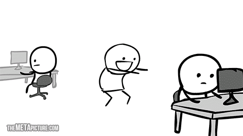

# Hello friends. 

# I'm **Bryon Smith**. Thanks for stopping by. &#x1F604;

<!-- <div id="header" align="center">

</div> -->

```javascript
const bryon = {
  pronouns: 'He' | 'Him',
  askMeAbout: ['web dev', 'tech', 'automotive'],
  technologies: {
    frontEnd: {
      js: ['vanilla', 'react', 'typescript', 'nextjs'],
      css: ['vanilla', 'modules', 'sass', 'tailwindcss', 'bootstrap'],
    },
    backEnd: 'nodejs',
    databases: 'mongodb',
  },
}
```


Hello all.


<a href="https://github.com/webmastersmith/webmastersmith">
  
</a>
<a href="https://github.com/webmastersmith/webmastersmith">
  
</a>

#


<!-- laughs -->
<!-- <div id="laughs">
<h1>Just for laughs!</h1> -->

<!-- <div id="me">

<span>
<div>
This is me, coding.
</div>

</span>
<span align="center">
<div>
This is me, reality.
</div>

</span>

<div>

Code I'm most proud of: ""

</div>

<div>
Office Humor
</div>


</div> -->
<!-- end laughs -->

<!-- <div id="future">
<p>Where do I see myself in 10 years?</p>
</div> -->
