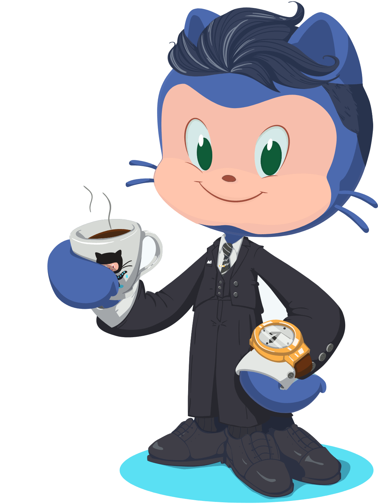

# Hello friends.  I'm **Bryon Smith**. Thanks for stopping by. &#x1F604;

```javascript
const bryon = {
  askMeAbout: ['web dev', 'tech', 'automotive'],
  technologies: {
    frontEnd: {
      js: ['vanilla', 'react', 'typescript', 'nextjs'],
      css: ['vanilla', 'modules', 'sass', 'tailwindcss', 'bootstrap'],
      html: 'HTML5',
      animation: ['vanilla', 'framer', 'react-spring'],
    },
    backEnd: [
      'nodejs',
      'apache',
      'debian',
      'postfix',
      'dovecot',
      'modsecurity',
      'iptables',
    ],
    databases: ['mongodb', 'mysql', 'firestore'],
    auth: ['firebase', 'nextauth'],
    webscraper: 'puppeteer',
  },
}
```

#

<!-- https://simpleicons.org/ -->


#


I have owned and managed a successful mechanic shop. I have licenses as a ASE Master Technician/L1 Advanced Engine Performance, air conditioning tech, electrician, A/P aircraft mechanic, and now I'm an aspiring full stack engineer. I'm passionate about all things programming, love learning, helping others, and building a rich community.

<p> </p>

## &#x1f4c8; GitHub Stats

<a href="https://github.com/webmastersmith/webmastersmith">
  
</a>
<a href="https://github.com/webmastersmith/webmastersmith">
  
</a>

#

<div align="center">


</div>
